# 🎨 Visual Architecture Guide
## WhatsApp AI Sales Agent - Complete System Overview

---

## 🏗️ HIGH-LEVEL SYSTEM ARCHITECTURE

---

## 📊 COMPLETE DATA FLOW - Customer Journey

### Scenario: Customer sends dress image and completes purchase

```mermaid
sequenceDiagram
    participant C as 👤 Customer<br/>WhatsApp
    participant T as 📱 Twilio<br/>WhatsApp API
    participant W as 🔄 Webhook<br/>Handler
    participant O as 🧠 Orchestrator<br/>Message Handler
    participant DB as 💾 Supabase<br/>Database
    participant V as 🧮 pgvector<br/>Embeddings
    participant AI as 🤖 Gemini<br/>AI Reasoning
    participant TR as 🛠️ Tool<br/>Registry
    participant P as 💰 PayLink<br/>M-Pesa
    
    Note over C,P: STEP 1: Customer sends dress image
    C->>T: "Do you have this dress?" + 📷 image
    T->>W: POST /webhook/whatsapp<br/>{From, Body, MediaUrl0}
    
    Note over W,DB: STEP 2: Validate & Save
    W->>W: Validate Twilio signature ✓
    W->>O: handle_whatsapp_message(request)
    O->>DB: Get/Create conversation
    O->>DB: Save customer message
    
    Note over O,V: STEP 3: Fetch Context
    O->>DB: Fetch last 8 messages
    O->>DB: Get customer profile
    O->>DB: Get business inventory
    O->>V: Search relevant memories
    
    Note over O,AI: STEP 4: Analyze Image
    O->>TR: analyze_image(image_url)
    TR->>AI: Gemini Vision API<br/>"Analyze this fashion item"
    AI-->>TR: {type: "dress", style: "casual",<br/>colors: ["blue", "white"],<br/>pattern: "floral"}
    TR->>V: Generate embedding
    TR->>V: Search similar products
    V-->>TR: [product1, product2, product3]
    
    Note over O,AI: STEP 5: AI Reasoning
    O->>O: Build prompt with:<br/>- Image analysis<br/>- Matching products<br/>- Customer history<br/>- Conversation context
    O->>AI: generate_response(prompt)
    AI-->>O: {<br/>reply_text: "Found 3 dresses...",<br/>actions: [],<br/>intent: "product_search",<br/>entities: {...}<br/>}
    
    Note over O,DB: STEP 6: Save & Respond
    O->>DB: Save agent message
    O->>W: Return response
    W->>T: Send WhatsApp message
    T->>C: "Hi! 😊 Found 3 dresses:<br/>1. Blue Floral Midi - KES 2,500..."
    
    Note over C,P: STEP 7: Customer selects & adds to cart
    C->>T: "I want #1 in size M"
    T->>W: POST /webhook/whatsapp
    W->>O: handle_whatsapp_message(request)
    O->>AI: Classify intent → "add_to_cart"
    O->>TR: add_to_cart(product_id, size, quantity)
    TR->>DB: Update conversation metadata
    O->>W: "Added to cart! Total: KES 2,500"
    W->>T: Send response
    T->>C: "Added! Ready to checkout?"
    
    Note over C,P: STEP 8: Checkout & Payment
    C->>T: "Yes, checkout"
    T->>W: POST /webhook/whatsapp
    W->>O: handle_whatsapp_message(request)
    O->>AI: Classify intent → "checkout"
    O->>TR: create_order(cart_items, customer)
    TR->>DB: INSERT INTO orders
    O->>TR: initiate_mpesa_stk(phone, amount)
    TR->>P: POST /api/v1/stk-push
    P-->>TR: {status: "pending", reference: "MPX123"}
    O->>W: "Payment request sent to your phone"
    W->>T: Send response
    T->>C: "💳 Check your phone for M-Pesa prompt"
    
    Note over C,P: STEP 9: Customer approves payment
    C->>C: Enter M-Pesa PIN on phone
    P->>W: POST /webhook/paylink/callback<br/>{status: "success", reference: "MPX123"}
    W->>DB: UPDATE orders SET status='paid'
    W->>DB: UPDATE products SET stock=stock-1
    W->>T: Send confirmation
    T->>C: "✅ Payment received!<br/>Order confirmed. Delivery in 2-3 days"
    
    Note over O,V: STEP 10: Save memory
    O->>V: save_memory("Customer bought<br/>Blue Floral Dress, size M, KES 2,500")
```

---

## 🔄 NEW ORCHESTRATOR ARCHITECTURE (Tool-Centered)

### How the Orchestrator Replaces LangGraph

**Key Differences:**
- ❌ **Old:** 4-6 LLM calls per message (expensive, slow, unpredictable)
- ✅ **New:** 1 LLM call per message (cheap, fast, predictable)
- ❌ **Old:** LLM decides routing (probabilistic)
- ✅ **New:** Code decides routing (deterministic)

---

## 🗄️ DATABASE SCHEMA - Multi-Tenant Architecture

**Multi-Tenant Isolation:**
- Every table has `business_id` (except BUSINESSES)
- Row Level Security (RLS) enforces tenant boundaries
- One boutique cannot access another's data

---

## 🛠️ TOOL REGISTRY ARCHITECTURE

```mermaid
graph LR
    subgraph "Tool Categories"
        A[📦 Product Tools]
        B[🛒 Cart Tools]
        C[💳 Payment Tools]
        D[🖼️ Image Tools]
        E[👤 Customer Tools]
        F[🧠 Memory Tools]
    end
    
    subgraph "Product Tools"
        A1[get_inventory]
        A2[search_products]
        A3[search_similar_products]
        A4[get_product_details]
    end
    
    subgraph "Cart Tools"
        B1[add_to_cart]
        B2[remove_from_cart]
        B3[get_cart]
        B4[clear_cart]
    end
    
    subgraph "Payment Tools - PayLink"
        C1[initiate_mpesa_stk]
        C2[check_payment_status]
        C3[process_payment_callback]
    end
    
    subgraph "Image Tools"
        D1[analyze_image]
        D2[download_whatsapp_image]
        D3[generate_embedding]
    end
    
    subgraph "Customer Tools"
        E1[get_customer_profile]
        E2[update_customer_profile]
        E3[get_purchase_history]
    end
    
    subgraph "Memory Tools"
        F1[save_memory]
        F2[search_memories]
        F3[get_conversation_summary]
    end
    
    A --> A1 & A2 & A3 & A4
    B --> B1 & B2 & B3 & B4
    C --> C1 & C2 & C3
    D --> D1 & D2 & D3
    E --> E1 & E2 & E3
    F --> F1 & F2 & F3
    
    style C fill:#00C853,stroke:#00A843,stroke-width:2px,color:#fff
    style C1 fill:#00C853,stroke:#00A843,color:#fff
    style C2 fill:#00C853,stroke:#00A843,color:#fff
    style C3 fill:#00C853,stroke:#00A843,color:#fff
```

---

## 💰 PAYLINK M-PESA INTEGRATION FLOW

```mermaid
sequenceDiagram
    participant C as 👤 Customer
    participant O as 🧠 Orchestrator
    participant TR as 🛠️ Tool Registry
    participant P as 💰 PayLink API
    participant M as 📱 M-Pesa
    participant W as 🔄 Webhook Handler
    participant DB as 💾 Database
    
    Note over C,DB: Customer ready to pay
    C->>O: "Checkout"
    O->>TR: create_order(cart_items)
    TR->>DB: INSERT INTO orders<br/>(status='pending')
    DB-->>TR: order_id
    
    Note over O,P: Initiate M-Pesa STK Push
    O->>TR: initiate_mpesa_stk(phone, amount, order_id)
    TR->>P: POST /api/v1/stk-push<br/>{<br/>  phone: "+254712345678",<br/>  amount: 2500,<br/>  reference: order_id<br/>}
    P-->>TR: {<br/>  status: "pending",<br/>  checkout_request_id: "ws_CO_123",<br/>  mpesa_reference: "MPX123"<br/>}
    TR->>DB: UPDATE orders<br/>SET mpesa_reference='MPX123'
    TR-->>O: Payment initiated
    O->>C: "💳 Check your phone for M-Pesa prompt"
    
    Note over C,M: Customer approves on phone
    C->>M: Enter M-Pesa PIN
    M->>M: Process payment
    
    Note over M,W: PayLink sends callback
    M->>P: Payment confirmed
    P->>W: POST /webhook/paylink/callback<br/>{<br/>  status: "success",<br/>  mpesa_reference: "MPX123",<br/>  amount: 2500,<br/>  transaction_id: "QGX123ABC"<br/>}
    
    Note over W,DB: Update order status
    W->>DB: UPDATE orders<br/>SET status='paid',<br/>    transaction_id='QGX123ABC'<br/>WHERE mpesa_reference='MPX123'
    W->>DB: UPDATE products<br/>SET stock = stock - quantity
    W->>C: "✅ Payment received! Order confirmed"
    
    Note over W,DB: If payment fails
    alt Payment Failed
        M->>P: Payment failed/cancelled
        P->>W: POST /webhook/paylink/callback<br/>{status: "failed"}
        W->>DB: UPDATE orders SET status='failed'
        W->>C: "❌ Payment failed. Try again?"
    end
```

**PayLink Configuration:**
- **API Key:** Stored in `.env` as `PAYLINK_API_KEY`
- **Username:** Stored in `.env` as `PAYLINK_USERNAME`
- **Callback URL:** `https://your-domain.com/webhook/paylink/callback`
- **STK Push Endpoint:** `https://api.paylink.co.ke/api/v1/stk-push`

---

## 📱 FRONTEND DASHBOARD - What We're Building

```mermaid
graph TB
    subgraph "Next.js Dashboard - Boutique Owner View"
        A[🏠 Overview Page]
        B[💬 Conversations Page]
        C[📦 Products Page]
        D[📋 Orders Page]
        E[👥 Customers Page]
        F[⚙️ Settings Page]
    end
    
    subgraph "Overview Components"
        A1[📊 Analytics Cards<br/>Sales/Conversations/Orders]
        A2[📈 Revenue Chart<br/>Last 30 days]
        A3[🔥 Top Products<br/>Best sellers]
        A4[⚡ Recent Activity<br/>Live feed]
    end
    
    subgraph "Conversations Components"
        B1[📱 Contact List<br/>All WhatsApp threads]
        B2[💬 Chat Viewer<br/>Read-only messages]
        B3[🖼️ Image Bubbles<br/>Customer uploads]
        B4[💳 Payment Status<br/>Order markers]
    end
    
    subgraph "Products Components"
        C1[➕ Add Product Form<br/>Name/Price/Images]
        C2[📋 Product List<br/>Grid/Table view]
        C3[✏️ Edit Product<br/>Update details]
        C4[📸 Image Upload<br/>Multiple images]
        C5[🎨 Fashion Attributes<br/>Size/Color/Style]
    end
    
    subgraph "Orders Components"
        D1[📋 Orders Table<br/>All orders]
        D2[🔍 Order Details<br/>Items/Customer/Payment]
        D3[📦 Fulfillment Status<br/>Pending/Shipped/Delivered]
        D4[💰 Payment Status<br/>Paid/Pending/Failed]
    end
    
    A --> A1 & A2 & A3 & A4
    B --> B1 & B2 & B3 & B4
    C --> C1 & C2 & C3 & C4 & C5
    D --> D1 & D2 & D3 & D4
    
    style A fill:#4285f4,stroke:#1967d2,color:#fff
    style C fill:#34a853,stroke:#0f9d58,color:#fff
```

---

## 🚀 DEPLOYMENT ARCHITECTURE

```mermaid
graph TB
    subgraph "Production Environment"
        subgraph "Google Cloud Platform"
            A[☁️ Cloud Run<br/>Backend API<br/>Region: africa-south1]
            B[🔐 Secret Manager<br/>API Keys/Credentials]
        end
        
        subgraph "Supabase Cloud"
            C[(💾 PostgreSQL<br/>Database)]
            D[(🧮 pgvector<br/>Embeddings)]
            E[📁 Storage<br/>Product Images]
        end
        
        subgraph "Vercel"
            F[💻 Next.js Dashboard<br/>Edge Network]
        end
        
        subgraph "External Services"
            G[📱 Twilio<br/>WhatsApp API]
            H[💰 PayLink<br/>M-Pesa Gateway]
            I[🤖 Google AI<br/>Gemini API]
        end
    end
    
    subgraph "Traffic Flow"
        J[👤 Customers<br/>WhatsApp]
        K[👔 Boutique Owners<br/>Web Browser]
    end
    
    J -->|WhatsApp Messages| G
    G -->|Webhook| A
    A -->|Store Data| C
    A -->|Search Vectors| D
    A -->|Upload Images| E
    A -->|AI Reasoning| I
    A -->|Process Payments| H
    H -->|Callback| A
    
    K -->|HTTPS| F
    F -->|API Calls| C
    F -->|Read Images| E
    
    A -.->|Secrets| B
    
    style A fill:#4285f4,stroke:#1967d2,stroke-width:2px,color:#fff
    style F fill:#000,stroke:#000,stroke-width:2px,color:#fff
    style C fill:#3ECF8E,stroke:#38BC81,stroke-width:2px,color:#fff
    style H fill:#00C853,stroke:#00A843,stroke-width:2px,color:#fff
```

**Deployment Regions:**
- **Backend:** `africa-south1` (Johannesburg) - Low latency for Kenya
- **Database:** Supabase `eu-west-1` (closest available)
- **Frontend:** Vercel Edge Network (global CDN)

---

## 🔐 SECURITY & MULTI-TENANCY

**Security Layers:**
1. **Webhook Signature Validation** (Twilio, PayLink)
2. **Business Identification** (from phone number)
3. **Row Level Security** (Supabase RLS)
4. **API Key Protection** (Secret Manager)
5. **HTTPS Only** (TLS 1.3)

---

## 📊 WHAT WE'RE BUILDING - Complete Feature Set

---

## ⏱️ PERFORMANCE TARGETS

**Total Target:** < 4.5 seconds from customer message to response

**Optimization Strategies:**
- Cache product embeddings
- Connection pooling for database
- Async/await for all I/O
- Lazy load conversation history
- Compress images before storage

---

## 📈 SCALING STRATEGY

---

## 🎯 SUCCESS METRICS DASHBOARD

```mermaid
graph TB
    subgraph "Platform Metrics"
        A[📊 Active Boutiques<br/>Target: 100 by Month 6]
        B[💰 MRR<br/>Target: $20,000 by Month 6]
        C[⚡ System Uptime<br/>Target: 99.9%]
    end
    
    subgraph "Per-Boutique Metrics"
        D[💬 Conversations/Day<br/>Target: 50-100]
        E[🛒 Conversion Rate<br/>Target: 15-25%]
        F[💵 Average Order Value<br/>Target: KES 3,000-5,000]
        G[⭐ Customer Satisfaction<br/>Target: 4.5+/5]
    end
    
    subgraph "Technical Metrics"
        H[⚡ Response Time<br/>Target: < 4.5s]
        I[💸 AI Cost per Conversation<br/>Target: < $0.05]
        J[✅ Payment Success Rate<br/>Target: > 95%]
    end
    
    style B fill:#00C853,stroke:#00A843,color:#fff
    style E fill:#4285f4,stroke:#1967d2,color:#fff
    style J fill:#00C853,stroke:#00A843,color:#fff
```

---

## 🚀 READY TO BUILD!

**You now have:**
1. ✅ Complete visual architecture
2. ✅ Data flow diagrams
3. ✅ PayLink M-Pesa integration flow
4. ✅ Database schema with multi-tenancy
5. ✅ Tool registry structure
6. ✅ Frontend dashboard components
7. ✅ Deployment architecture
8. ✅ Security model
9. ✅ Performance targets
10. ✅ Scaling strategy

**Next:** Start implementing Phase 1 (Backend Migration) with the orchestrator!
